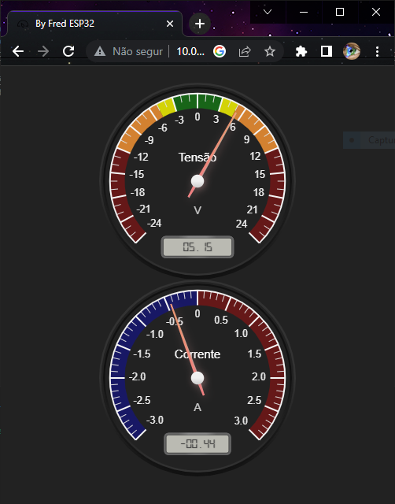
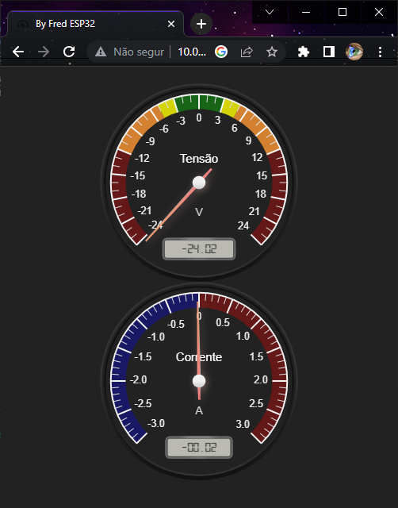
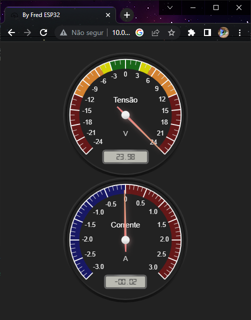
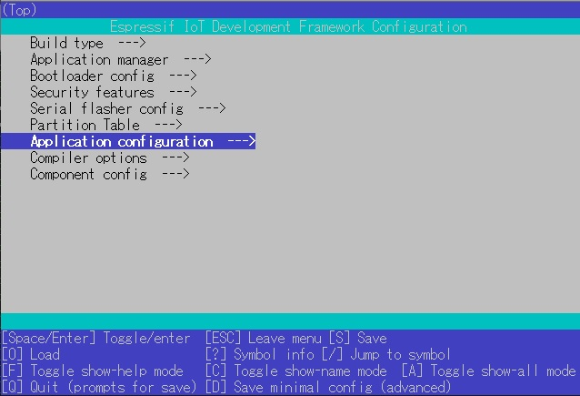
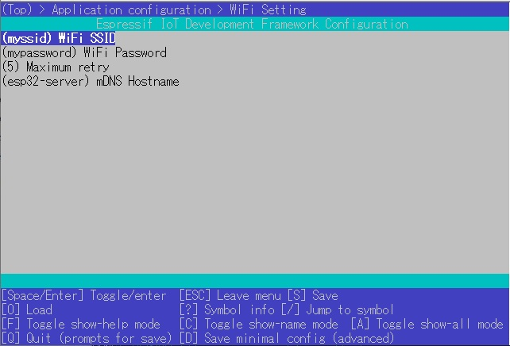
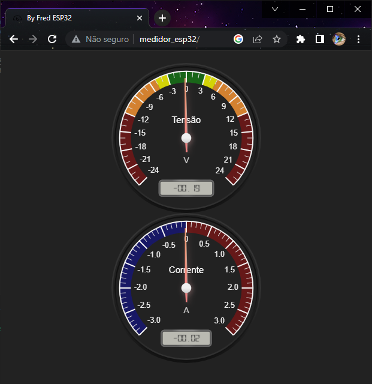

# Medidor de Tensão e Corrente elétrica

O objetivo principal desse projeto é viabilizar a apresentação por projeção ou acesso direto dos alunos, por meio de um navegador web, aos valores de tensão e corrente lidos por um hardware em tempo real. 

Este mecanismo foi solicitado pelo <strong>Professor Valter Terrão</strong>, como facilitador na aprendizagem de seus alunos.

O ESP32 possui dois ADCs, ADC1 e ADC2. Este projeto usa ADC1. 

O mostrador de tensão foi dividido:
* Lado direito, as tensões positivas;
* Lado esquerdo, as tensões negativas.

A escala foi subdividida em:
* Verde até 3V (Sistemas embarcados, IoT.);
* Amarelo até 5V (Sistemas mais antigos.);
* Laranja até 12V (Reles de interface, motores DC.)
* Vermelho até 24V (Reles, contatores, etapa de potência.)

O mostrador de corrente foi dividido:
* Lado direito, as correntes positivas;
* Lado esquerdo, as correntes negativas.

---

## Mostradores analógicos com zero central e indicador digital

---
# Atenuação ADC
Este projeto usa ADC_ATTEN_DB_11(11dB) para atenuação. 
A atenuação de 11dB (ADC_ATTEN_DB_11) fornece uma tensão de escala completa de 3,3V. 
Mas o alcance que pode ser medido com precisão é o seguinte: 

A faixa de tensão de entrada mensurável para: 
* ESP32 é de 150 mV ~ 2450 mV. 
* ESP32S2 é de 0 mV ~ 2500 mV. 
* ESP32S3 é de 0 mV ~ 3100 mV. 
* ESP32C3 é de 0 mV ~ 2500 mV. 
* ESP32C2 é de 0 mV ~ 2800 mV. 

Esse projeto utiliza o sistema de calibração pelos valores fornecidos no eFuse, gravados na fabricação do ESP.

## Erro gerado
Em função da variação dos conversores AD do ESP, existe no inicio e no fim da escala de leitura, um erro com variação média de -5mV a +20mV. 

 
---

# Requisitos de software
## Bibliotecas:
ESP-IDF V4.4/V5.0/V5.1. 
ESP-IDF V5.0 é necessário para usar o ESP32-C2. 

## Servidor WebSocket:
Bibliotecas e informações de [Molorius](https://github.com/Molorius/esp32-websocket/tree/master). 

## JSON:
Informação inicial da [Espressif](https://github.com/espressif/esp-idf/tree/master/components/json). 
Biblioteca de [Dave Gamble](https://github.com/DaveGamble/cJSON). 

## Mostradores:
Bibliotecas e exemplos em [Canvas Gauges](https://canvas-gauges.com/). 

---
# Configuração

>idf.py menuconfig

Acessar: <strong>Application configuration--></strong> 
 

Acessar: <strong>WiFi setting--></strong> 
Alterar: <strong>WiFi SSID--></strong> Para o nome de seu AP. 
Alterar: <strong>WiFi Password--></strong> Para a senha de seu AP. 
 

---
## Iniciar um navegador da web
### Limitação:

Nos navegadores Windows ou IOS(Apple) é possível usar o endereço IP ou por mDNS: <strong>medidor_esp32/</strong> 
Mas o Android não da suporte ao mDNS, então só é possível acessar o ESP através do IP. 
 

Digite na barra de endereço do seu navegador:

>http://{IP do ESP32}/  (exemplo: http://192.168.0.100/) 

ou 
>http://medidor_esp32/  (não funciona em sistemas Android) 

### Nota:
>O endereço: http://medidor_esp32/, não funciona em sistemas Android.

---

## Usando nome de host mDNS
Você pode se conectar usando o nome do host mDNS em vez do endereço IP.

### esp-idf V4.4 ou esp-idf V4.4.1
Se você definir CONFIG_MDNS_STRICT_MODE=y em sdkconfig.defaults, o firmware será construído com MDNS_STRICT_MODE.
Se MDNS_STRICT_MODE não for definido, a resolução de nome mDNS não será possível após operação de longo prazo. 

### esp-idf V5.0 ou posterior
O componente mDNS foi atualizado.
A operação de longo prazo é possível sem definir MDNS_STRICT_MODE.
As seguintes linhas em sdkconfig.defaults devem ser removidas antes do menuconfig.
CONFIG_MDNS_STRICT_MODE=y

---
## Páginas WEB
As páginas da WEB são armazenadas na pasta <strong>html</strong>. 
Você pode alterá-lo como quiser.

## Atenção
A alteração de nome de arquivo(s) impacta nos seguites arquivos (devem ser alterados confome suas necessidades):
* CMakeLists.txt da pasta main;
* web_server.c na função http_server().

